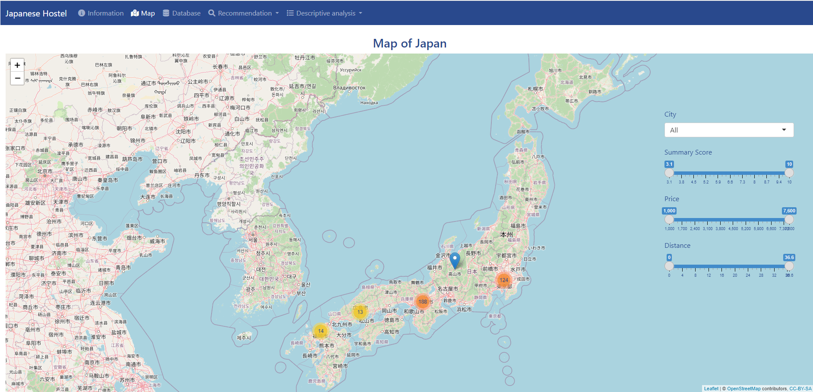
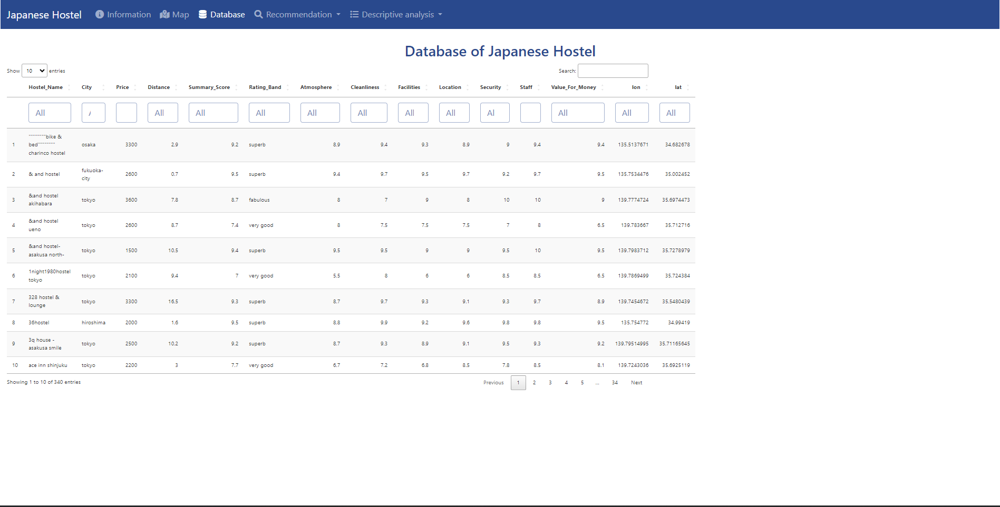
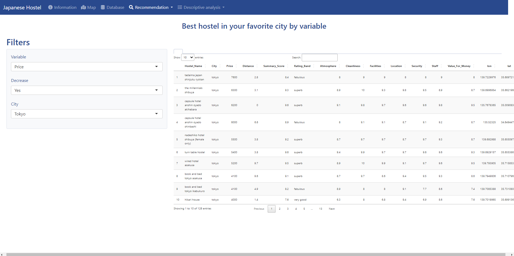
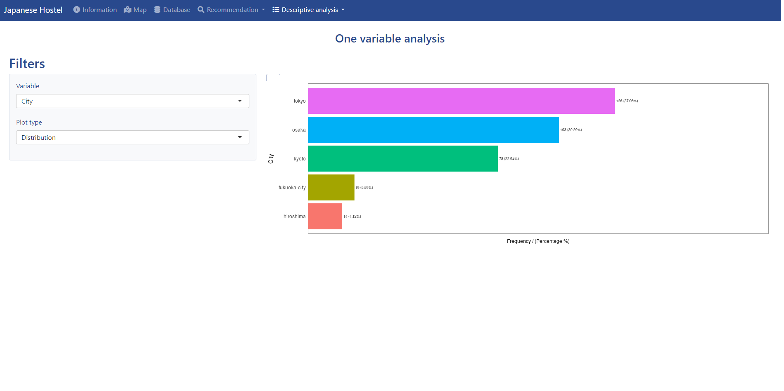

---

# R Programming Project

## Introduction

This project was carried out in collaboration by Claire Gefflot, Romain Pénichon et Ariane Mostamandy. We utilized the dataset "Hostel.csv" available on the drive, sourced from the scraping of HostelWorld.com and also accessible on [Kaggle](https://www.kaggle.com/koki25ando/hostel-world-dataset).

The primary objective of this project was to apply various concepts learned during our R training, including dplyr, data visualization, vectorized functions, and more. We aimed to develop simple and effective code while also delving into advanced concepts through self-directed learning.

## Part 1: Descriptive Analysis

In the first part of our project, we conducted a descriptive analysis of the dataset. We identified a relevant problem statement and summarized essential information extracted from the dataset. We paid particular attention to presenting the results using numbered tables and graphs.

## Part 2: Shiny Application

The second part of our project involved creating a Shiny application to complement our analysis. Our application provides users with an interactive experience, featuring a responsive map. This map allows users to make personalized selections. We deployed our application on Shinyapps.io for maximum accessibility.

[Link of our R-shiny interface](https://c217.shinyapps.io/GEFFLOT_PENICHON_MOSTAMANDY/)

### Utility and Significance of the Application

Our Shiny application enables users to visually explore the data interactively. It offers a deeper understanding of the information within the "Hostel.csv" dataset. Users can interact with the map to discover trends and insights.

### Submitted Files

- [PDF Document](NomEtu1_NomEtu2_NomEtu3.pdf)
- [R or Rmd Script](NomEtu1_NomEtu2_NomEtu3.R)
- [Link of our R-shiny interface](https://c217.shinyapps.io/GEFFLOT_PENICHON_MOSTAMANDY/)
- Examples of interface :

---